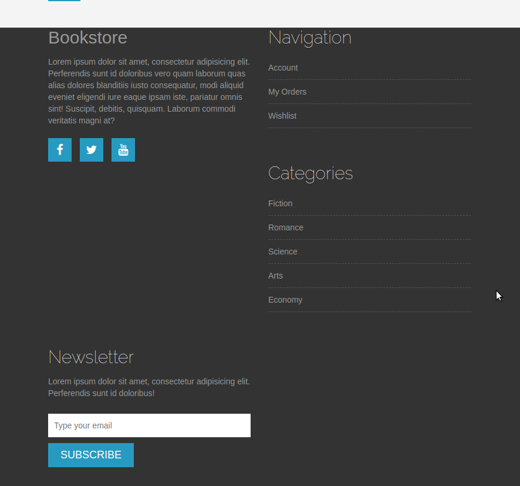
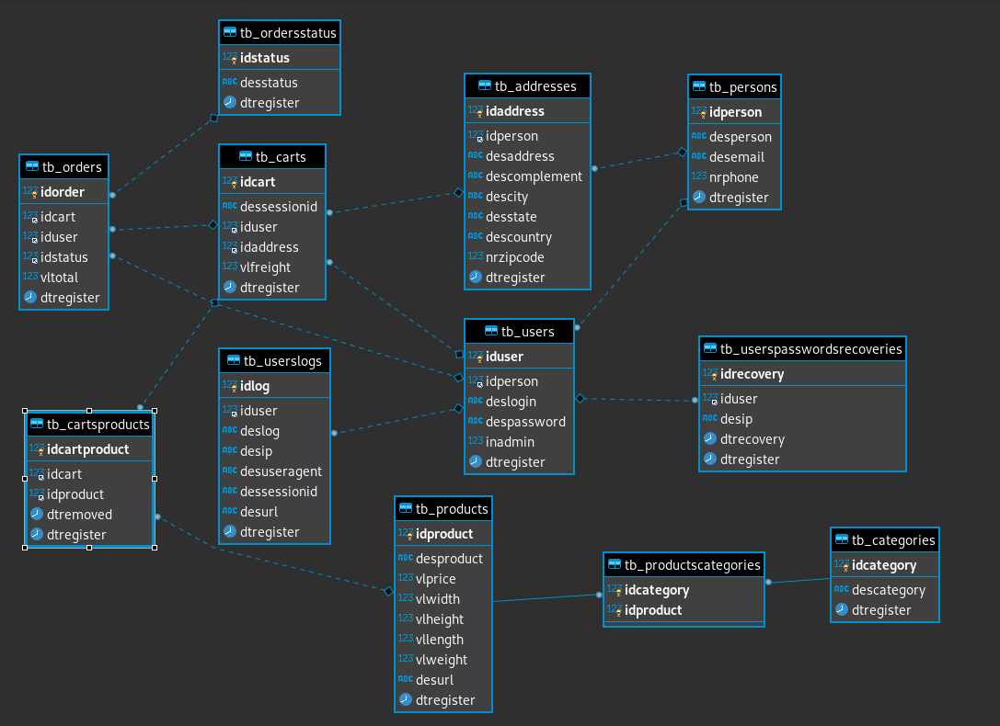

<h1>Bookstore Website</h1>

Repositório destinado ao estudo de PHP para aplicações web.
     O foco desse repositório a princípio foi o de desenvolver 
     um e-commerce de uma livraria. Dessa maneira o php foi utilizado 
     com o auxílio do composer, que é a nova maneira de realizar projetos em php. 

    Alguns links úteis:
    <ul>
        <li><a href="https://getcomposer.org/">https://getcomposer.org/</a></li>
        <li><a href="https://github.com/feulf/raintpl">https://github.com/feulf/raintpl</a></li>
        <li><a href="https://github.com/PHPMailer/PHPMailer">https://github.com/PHPMailer/PHPMailer</a></li>
        <li><a href="http://www.slimframework.com/">http://www.slimframework.com/</a></li>
        <li><a href="https://www.digitalocean.com/community/tutorials/como-instalar-o-mysql-no-ubuntu-18-04-pt">https://www.digitalocean.com/community/tutorials/como-instalar-o-mysql-no-ubuntu-18-04-pt</a></li>
        <li><a href="https://chartio.com/resources/tutorials/how-to-grant-all-privileges-on-a-database-in-mysql/">https://chartio.com/resources/tutorials/how-to-grant-all-privileges-on-a-database-in-mysql/</a></li>
        <li><a href="https://www.digitalocean.com/community/tutorials/como-criar-um-novo-usuario-e-conceder-permissoes-no-mysql-pt">https://www.digitalocean.com/community/tutorials/como-criar-um-novo-usuario-e-conceder-permissoes-no-mysql-pt</a></li>
    </ul>

<h3>Aparência da home</h3>

<h3>Organização da base de dados</h3>

<h3> Algumas instruções...</h3>

<b>1-Composer</b>:

 Três códigos importantes

<code>composer install</code>

<code>composer dump-autoload</code>

<code>composer update</code>

<b>2-Mysql connection</b>

Para instalar e conectar um usuário ao mysql

<code>sudo apt update</code>

<code>sudo apt install mysql-server</code>

<code>mysql_secure_installation</code>

<code>sudo mysql -u root -p</code>

<code>USE mysql;</code>

<code>CREATE USER 'novousuario'@'localhost' IDENTIFIED BY 'password';</code>

<code>GRANT ALL PRIVILEGES ON * . * TO 'novousuario'@'localhost';</code>

<code>FLUSH PRIVILEGES;</code>

<b>3-Start no Xampp</b>

Primeiro acesse o terminal linux e escreva

<code>cd /opt/lampp</code>

<code>ls</code>

<code>sudo ./manager-linux-x64.run</code>

OBS: não se esqueça de verificar as portas. 
    O MySQL costuma rodar na porta 3306. 
    Se existir outra instância nessa porta ele pode gerar erro. 
    Neste caso direcione para outra porta, por exemplo a 3307.

